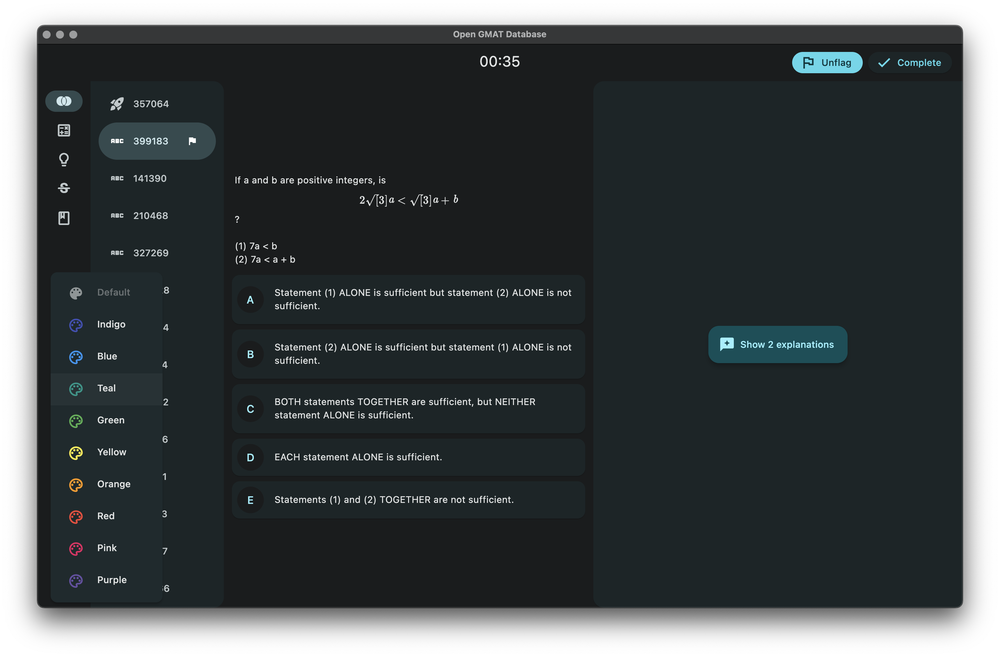
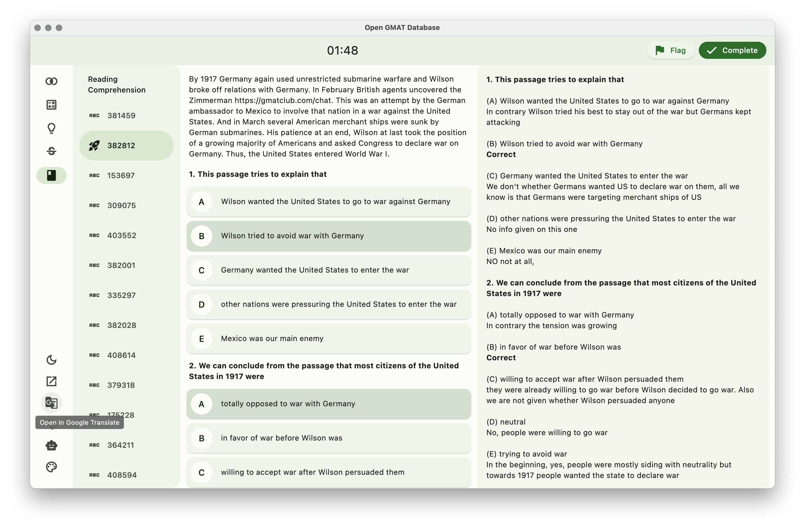

# GMAT Question Bank

GMAT Question Bank is a client for the [GMAT Database](https://github.com/teddyfullstack/gmat-database) project, designed to provide users with a wide range of GMAT practice questions to help them prepare for the GMAT exam. This app supports Material You design principles, allowing users to customize the app's appearance to their liking.

## Preview




## Features

### View Questions

Users can access a vast collection of GMAT practice questions on this app by navigating through various categories and sub-categories. Each question is presented in a clear and easy-to-read format, making it easy for users to understand the question and attempt it.

### Different Question Types

GMAT Question Bank supports five different types of questions: Quantitative Comparison, Data Sufficiency, Problem Solving, Sentence Correction, and Critical Reasoning. Users can select the question type they want to practice and filter the questions based on their difficulty level.

### Explanations

For each question, the app provides a detailed explanation of the solution, helping users understand the concepts involved and learn from their mistakes. The explanations are provided in an easy-to-understand language and include step-by-step solutions.

### Timing

GMAT Question Bank also includes a timer feature, allowing users to time their attempts and track their progress. Users can set the time limit for each question or practice set and try to complete it within the specified time. This feature helps users manage their time effectively during the GMAT exam and improve their speed and accuracy.

### Material You

The app supports Material You design principles, allowing users to customize the app's appearance by choosing from a range of color schemes and themes. Users can select a primary color and the app will generate a color palette based on that color, providing a unique and personalized experience.

## Usage

1. Clone the repository
2. Install Flutter by following the official documentation for your platform: https://flutter.dev/docs/get-started/install
3. Build and run the app by following the official documentation for your platform: https://flutter.dev/multi-platform

Example for running the app on Android:

```bash
flutter run -d <device-id>
```

Replace <device-id> with the ID of the connected Android device or emulator. You can find the ID by running `flutter devices`.

# License

This project is licensed under the MIT License.
